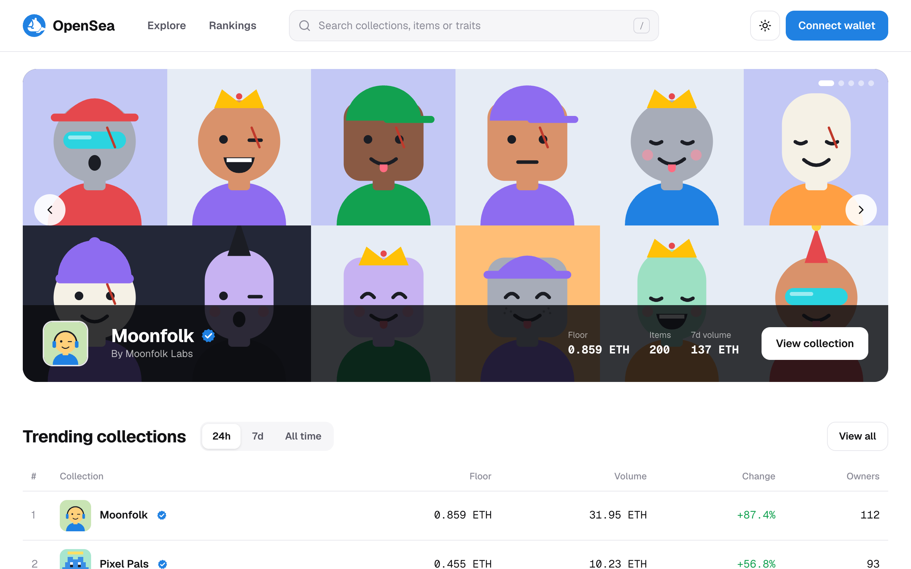
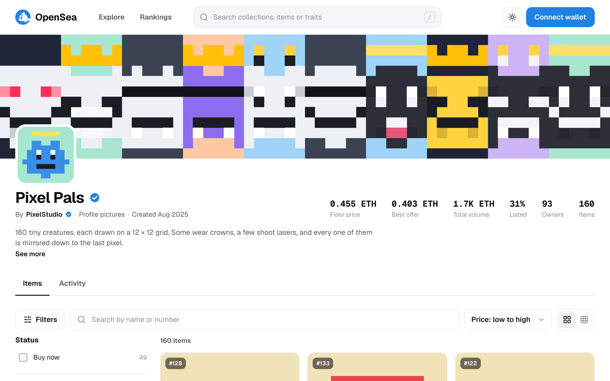
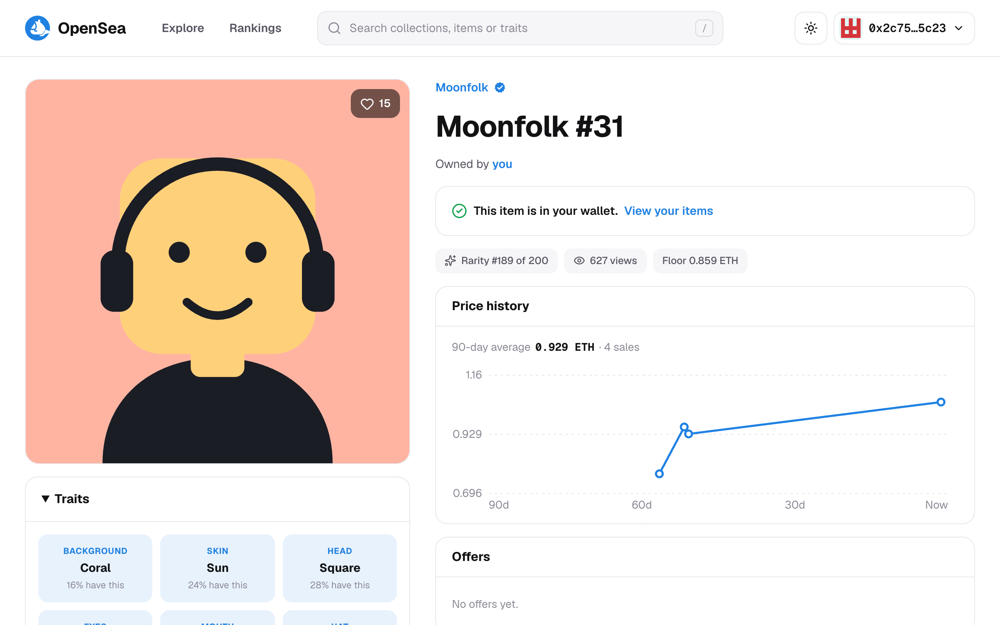
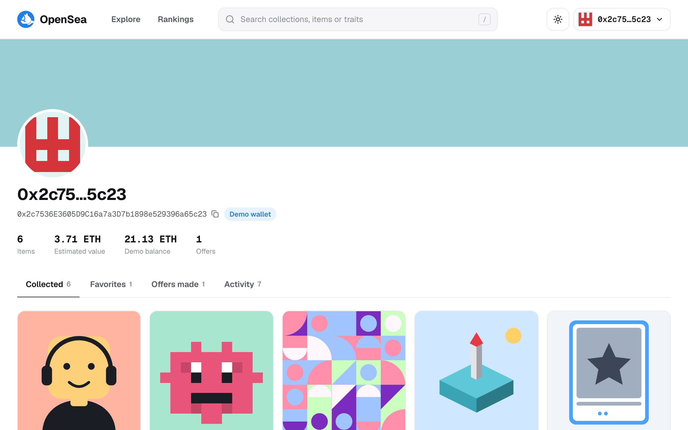

<div align="center">

# 🌊 OpenSea clone

**An NFT marketplace clone: browse collections, filter items by trait, and buy or make offers with a real wallet on the Sepolia test network, or a built-in demo wallet.**

[](https://nextjs.org)
[](https://react.dev)
[](https://www.typescriptlang.org)
[](https://wagmi.sh)
[](https://viem.sh)
[](https://sass-lang.com)
[](https://pnpm.io)
[](LICENSE)
<br />
[](https://github.com/boushib/opensea/commits/main)
[](https://github.com/boushib/opensea)
[](https://github.com/boushib/opensea)



</div>

## Screenshots

**Collection:** banner, stats, and items you can filter by buy-now, price and any trait, with rarity ranks



**Item:** traits and how rare they are, a 90-day price history, offers, and Buy now / Make offer



**Profile:** everything the connected wallet bought, favorited and offered, with each signature



## About

I first built this in 2022 with Create React App, Sanity and thirdweb, on the Rinkeby test network. All of those have since been retired, so in 2026 I rebuilt it from scratch on **Next.js 16** (App Router), **React 19** and **TypeScript**, with **wagmi** and **viem** for wallets and **Sass modules** for styling.

It runs entirely on its own: no database, no API keys and no NFT API. Seven made-up collections are generated from fixed seeds, and their art is drawn in code as SVG, so every image always loads and nothing is copied from real NFT projects.

## Features

### Marketplace
- **Home:** a carousel of featured collections, trending collections by 24h, 7-day or all-time volume, items that just sold, notable collections and categories
- **Explore** by category, and **Rankings** sortable by volume, change, floor price, sales, owners or items
- **Collections:** banner, creator, floor price, best offer, volume, listed share and owners; items filtered by buy-now, price range and every trait (with counts), searched, sorted five ways and shown in two grid sizes; an activity feed of sales, listings and offers; **analytics** with floor price and volume charts over 7, 30 or 90 days
- **Items:** traits with how common each value is, rarity rank, contract details, a price history chart, offers, the item's activity and more from the collection
- **Live auctions** on the home page and at `/auctions`, with countdowns and bid histories
- **Profiles** for every collector and creator, linked from owners, buyers and activity
- **Search** in the header with instant suggestions (press `/`), including items by number ("moonfolk 12") and by trait ("crown", "laser")

### Wallet and trading
- Connect **MetaMask, Rabby or any browser wallet**, **Coinbase Wallet**, or a mobile wallet through **WalletConnect** (with a project ID), on the **Sepolia** test network. Your balance, your **ENS name** and a prompt to switch networks are shown
- Or use the **demo wallet**: no extension needed, it lives in your browser and starts with 25 demo ETH
- **Buy** one item or several at once from the **cart**, **make offers** on items or on a whole collection, and **bid in auctions**
- **Sell** what you own: list it, accept offers collectors make on it, or transfer it to another address
- **Create a collection:** name it, pick one of seven art styles, choose its size and mint the items into your wallet, then list and sell them
- **Notifications** for sales, accepted and received offers, filled collection offers, being outbid, and auctions won or lost
- A **profile** with collected and created items, listings, offers made and received, favorites and signed activity

> This is a demo. Every trade is a signed message, so no funds ever move, even with a real wallet. Other collectors are simulated in your browser (`lib/simulator.ts`): they buy fairly priced listings, accept good offers, fill collection offers, make offers on what you hold and bid against you in auctions.

### Design
- Flat colors, light and dark themes applied before the first paint, Geist and Geist Mono
- Responsive down to 320px: filters become a sheet, tables scroll, and the item page puts the price right after the art

## How the demo data works

Everything comes from seeded random numbers (`lib/rng.ts`), so it's the same on every visit:

- Each collection has an **art style** (`lib/art/`) that picks an item's traits from weighted options and draws it as SVG. Art is served at `/art/<collection>/<token>` and cached forever.
- **Rarity** comes from how often each trait value appears; rank 1 is the rarest item.
- **Prices, owners, listings, offers and 90 days of sales** (`lib/catalog.ts`) are generated around each collection's base price, with rarer items worth more. Stats like floor, volume, owners and 24h change are calculated from them.
- What you do with a wallet (purchases, listings, offers, bids, created collections, favorites, notifications) is saved in your browser, per wallet address (`lib/market.ts`).
- **Auctions** (`lib/auctions.ts`) run on repeating cycles; each run's rival bids come from its seed, and rivals counter your bids up to a hidden ceiling.
- **Created collections** keep their art style and a seed in the slug (like `c-moonfolk--k3j9x2`), so the server can draw every item without storing anything.

## Roadmap

Trading is simulated: there are no smart contracts yet, and activity is saved in your browser. [docs/ROADMAP.md](docs/ROADMAP.md) describes the on-chain version (ERC-721 contracts and Seaport on Sepolia, plus an order book and an indexer) for later.

## Getting started

Requires Node.js 20.9+ and pnpm.

```bash
pnpm install
pnpm dev
```

Open [http://localhost:3000](http://localhost:3000). No environment variables are needed. To turn on WalletConnect, copy `.env.example` to `.env.local` and add a free project ID from [Reown](https://dashboard.reown.com).

To use your own wallet, install [MetaMask](https://metamask.io/download/) (or another browser wallet) and pick the Sepolia test network. Free Sepolia ETH is available from public faucets, but you don't need any: signing costs nothing.

### Scripts

| Script | What it does |
| --- | --- |
| `pnpm dev` | Dev server |
| `pnpm build` / `pnpm start` | Production build and server |
| `pnpm lint` | ESLint (flat config) |
| `pnpm typecheck` | Route types and TypeScript, no emit |
| `pnpm dev:agent` / `pnpm build:agent` | The same on port 3500 with their own build folders, so a second server doesn't clash with yours |

## Project structure

```
app/                  Pages (home, explore, rankings, collection, item, auctions, create, account, user, search) and the /art route
components/           Layout, cards, collection, item, auction, cart, create, wallet and account UI
lib/art/              One SVG art style per collection
lib/catalog.ts        Collections, items, owners, prices and sales, built from seeds
lib/market.ts         Everything a wallet does, saved in the browser
lib/simulator.ts      The simulated collectors who trade with you
lib/auctions.ts       Auction cycles, rival bids and results
lib/wallet/           wagmi config (Sepolia, ENS on mainnet) and the demo wallet
```

## Disclaimer

This is a learning project and is not affiliated with or endorsed by OpenSea. The collections, creators, prices and activity are made up.

## License

[MIT](LICENSE) © El Hassane Boushib
